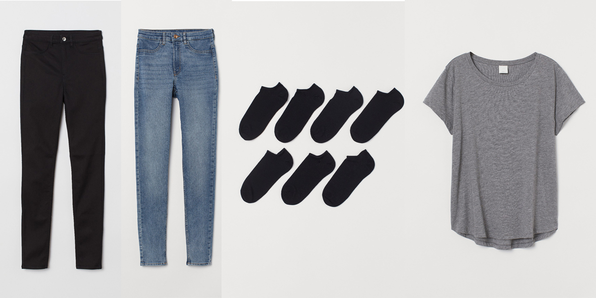

```{r setup, include=FALSE}
knitr::opts_chunk$set(echo = FALSE, message = FALSE, warning = FALSE)
```

# 50 year olds shopping at H&M? What’s that all about? 

## Question

For those who are unfamiliar with H&M, it’s a fast fashion retailer known for its affordable, youthful and trendy styles. My whole life I have been into fashion. Who knows? Maybe when I’m 50 I will still be shopping at H&M or similar stores, like Zara. However, even in my 30s, If I venture into H&M I feel noticeably older than everyone else there. So, where are these 50 year old and who are they? This lead me to questioning, does age actually matter for perceivably ‘younger’ and trendy stores like H&M? Are the different generational age groups actually purchasing different things? Spoiler alert, they are not. So what does this mean? Who are these 50 year olds and why are their purchase habits similar to the 20 somethings? 


## Context

The importance of these questions lies within the realm of demographics and marketing. Traditionally we believe that location, age, gender all matter and make a difference. And… they do. But, what if they don’t? In order to make appropriate and informed decisions it is important to do proper analysis to make sure we’re not assuming something about someones age or gender that ends up being incorrect. That is the beauty of data. We can dive in the deep end and really see what is beneath the surface of human bias. 


## Summary

I started this project with a very different question in mind. However. the very first thing I checked in the data was the age distribution. I really only did this to verify my own assumption that it would peak somewhere in the mid 20s and then continue to taper off as age increased. I was definitely surprised to see this somewhat bimodal distribution with a second peak around 50 years old. I remember thinking, “What?? That is so bizarre.” Twice as many 50 somethings as 30 somethings seemed just, wrong. 

```{r} 
library(ggplot2)
customers <- read.csv('/Users/rochellerafn/RStudio Files/h-and-m-personalized-fashion-recommendations/customers.csv') 

ggplot(customers, aes(age))+
  geom_bar(fill = 'black')+
  theme_bw()+
  xlim(15, 80)
```


My immediate thought was that it is a group of ‘young at heart’ and fashion conscious 50 year olds. Then, as I looked a little closer at the distribution I did the math and realized the peaks moved almost identically within about 30 years of each other. That logically seems pretty close to a parent-child age gap. This lead me to the question, does the age even matter? If the 50 year olds are actually purchasing for their children the items would be virtually the same.


## Data Description

The data set I’m analyzing comes directly from H&M spanning 1.3 million customers (ages 16-99), 53 online markets, 4,850 retail stores and 31 million transactions over 2 years. It came with three relational data frames with details on Customers, Articles (clothing items) and Transactions. 


## Exploratory Data Analysis

Given the question and data that I have, I decided to make age the outcome variable. How can we predict the difference between the young and mature generations? Or can we at all? To start, I split the data into the two age groups, “young” (<=39) and “mature” (>=40). This is where I would start my exploratory analysis to see what differences I could find. 

I began with the most obvious, what are the most popular items in each age group? This might show me if there are any differences. As we can see here, the top 3 items for both age groups are identical. However, the fourth item is different. This piqued my interest since that fourth items seems to indicate a generational difference. However, the more I dug, the less significant this difference became.

### Mature Top Items


### Young Top Items


### What are the most popular unique items in each age group?
I reduced the items even further by figuring out what each group purchased that the other did not. 

### Young Unique Items


### Mature Unique Items


On the surface it seemed that the younger group was purchasing more baby clothes and the mature generation not so much. However, each of the items were only purchased as much as 86 times out of more than 21million items purchased. Unfortunately the math here is not significant enough to consider.


### What are the top descriptive words for the unique items in each age group?
To move forward with the theme of unique items I decided to take those unique items even deeper by analyzing the descriptive words of these items. As I had guessed, the unique items really did not hold any significance due to the small amount. Also, even though the items are different, there are still many purchases by both groups that have the same descriptive words despite the specific item differing.

### Mature Top Words


### Young Top Words


### Young Top Word Count 
```{r}
library(tidyverse)

young_wordcounts <- read.csv('/Users/rochellerafn/RStudio Files/h-and-m-personalized-fashion-recommendations/young_wordcounts') %>%
  select(-X)

head(young_wordcounts, 10)
```

### Mature Top Word Count
```{r}
mature_wordcounts <- read.csv('/Users/rochellerafn/RStudio Files/h-and-m-personalized-fashion-recommendations/mature_wordcounts') %>%
  select(-X)

head(mature_wordcounts, 10)
```


## What about percentage of descriptive words?
Knowing that there are about twice as many in the young group as the mature group I thought I would go one step further and check proportion of the popularity. Still appears that there are no major and obvious differences.
```{r}
all_graphic_pct <- read.csv('/Users/rochellerafn/RStudio Files/h-and-m-personalized-fashion-recommendations/all_graphic_pct')

head(all_graphic_pct)
```


### Is there a noticeable difference in graphic appearance for each age group?
When analyzing the number of items with certain graphical appearances it is almost eerie how mirror like the purchasing habits are. Besides two variables, they move at extremely similar rates.


### What is the summary of price per age group?
```{r}
mature_transactions <- read.csv('/Users/rochellerafn/RStudio Files/h-and-m-personalized-fashion-recommendations/mature_transactions')
young_transactions <- read.csv('/Users/rochellerafn/RStudio Files/h-and-m-personalized-fashion-recommendations/young_transactions')

summary(mature_transactions$price)
summary(young_transactions$price)
```


### How many items are each group purchasing per transaction?
```{r}
summary(mature_transactions$n_items)
summary(young_transactions$n_items)
```

